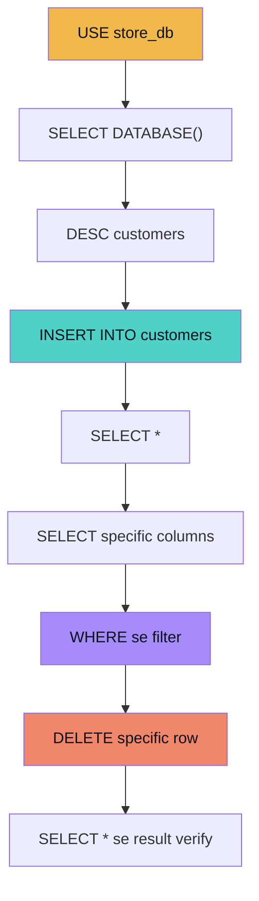
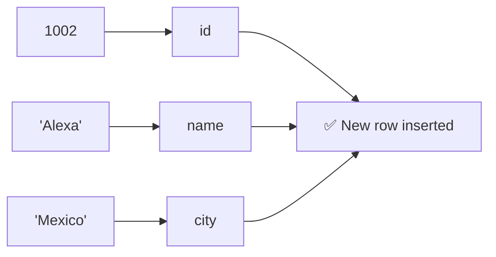
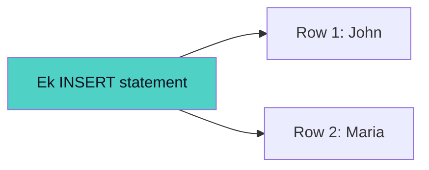
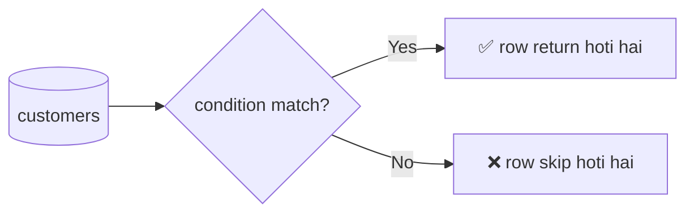
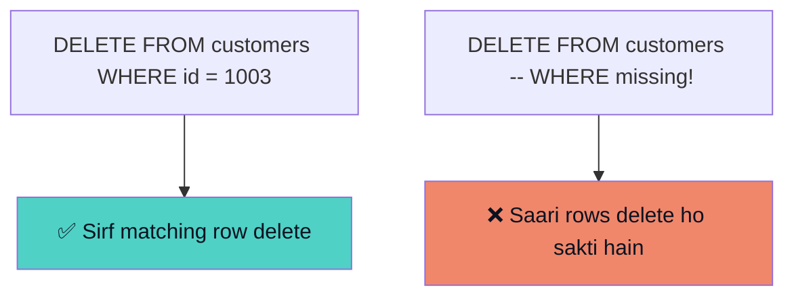
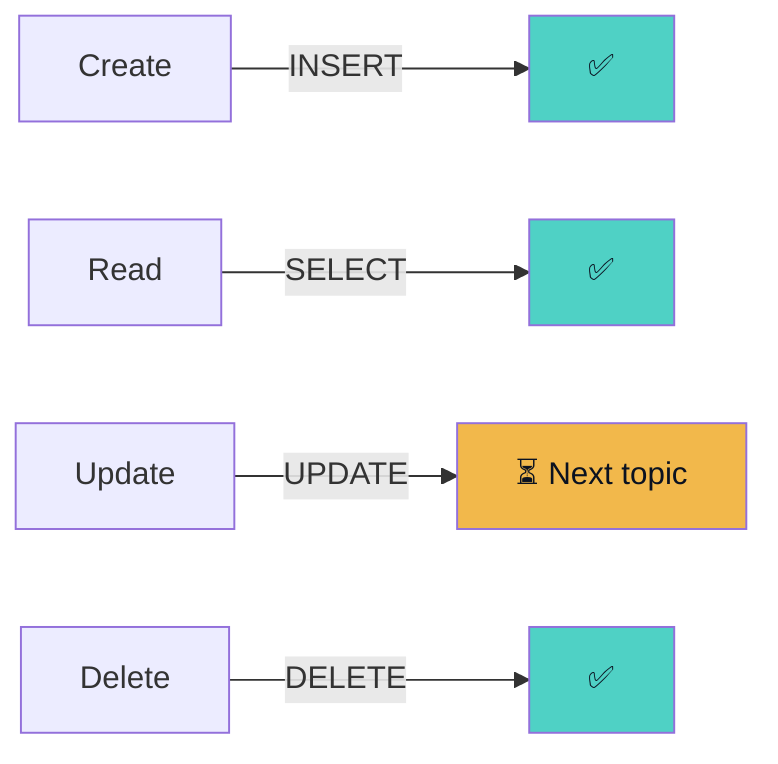
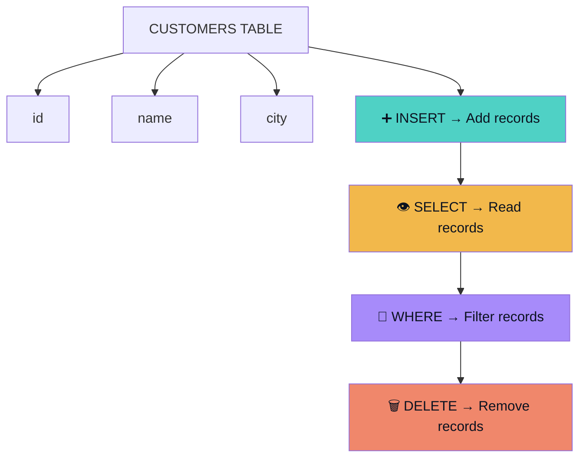

<div align="center">
# 🐬 MySQL Notes — INSERT, SELECT, WHERE & DELETE
### `USE DB` → `INSERT` → `SELECT` → `WHERE` → `DELETE`
 
*Learning Path: Select Database → Add Data → Read Data → Filter Data → Remove Data*
 


 
</div>
---
 
## 🗺️ Complete Practical Flow
 

 
## 🧭 Quick Overview
 
| Command | Purpose | Easy Question |
|---|---|---|
| 🗄️ **USE** | Kis database mein kaam karna hai | **Which database?** |
| ➕ **INSERT** | New records add karna | **Naya data kahan dalna hai?** |
| 👁️ **SELECT** | Data retrieve/read karna | **Mujhe kya dikhna chahiye?** |
| 🔎 **WHERE** | Records filter karna | **Kaunsi rows?** |
| 🗑️ **DELETE** | Records remove karna | **Kya hatana hai?** |
 
---
 
## 1️⃣ Selecting the Database
 
```sql
USE store_db;
```
 
Current selected database check karne ke liye:
 
```sql
SELECT DATABASE();
-- Output: store_db
```
 
> [!IMPORTANT]
> Correct: `SELECT DATABASE();`
> Incorrect: `SELECT DATABASES();` ❌
>
> `DATABASE()` current selected database ka naam return karta hai.
 
---
 
## 2️⃣ Checking Table Structure
 
```sql
DESC customers;
```
 
```text
+-------+--------------+------+-----+---------+-------+
| Field | Type         | Null | Key | Default | Extra |
+-------+--------------+------+-----+---------+-------+
| id    | int          | YES  |     | NULL    |       |
| name  | varchar(50)  | YES  |     | NULL    |       |
| city  | varchar(100) | YES  |     | NULL    |       |
+-------+--------------+------+-----+---------+-------+
```
 
---
 
## 3️⃣ INSERT INTO
 
`INSERT INTO` table mein **new data/records add** karne ke liye use hota hai.
 
```sql
INSERT INTO table_name(column1, column2, column3)
VALUES(value1, value2, value3);
```
 
```sql
INSERT INTO customers(id, name, city)
VALUES(1002, "Alexa", "Mexico");
```
 

 
---
 
## 4️⃣ Column Names Specify Karna
 
```sql
INSERT INTO customers(id, name, city)
VALUES(1002, "Alexa", "Mexico");
```
 
```text
id   → 1002
name → Alexa
city → Mexico
```
 
Data corresponding columns mein insert hota hai.
 
---
 
## 5️⃣ Table Name Correct Hona Zaroori Hai
 
> [!WARNING]
> ```sql
> INSERT INTO customer(id, name, city)  -- ❌ typo
> VALUES(1002, "Alexa", "Mexico");
> ```
> ```text
> ERROR 1146: Table 'store_db.customer' doesn't exist
> ```
> Actual table ka naam `customers` tha, na ke `customer`.
 
```sql
INSERT INTO customers(id, name, city)   -- ✅ correct
VALUES(1002, "Alexa", "Mexico");
```
 
> 🧠 **Lesson:** Table ka naam exactly correct hona chahiye.
 
---
 
## 6️⃣ Multiple Rows Insert Karna
 
```sql
INSERT INTO table_name(column1, column2, column3)
VALUES
(value1, value2, value3),
(value4, value5, value6);
```
 
```sql
INSERT INTO customers(id, name, city)
VALUES
(1003, "John", "Washington DC"),
(1004, "Maria", "Columbia");
-- Query OK, 2 rows affected
```
 

 
---
 
## 7️⃣ String Values
 
Text values quotes ke andar likhte hain: `"Alexa"`, `"Mexico"`, `"John"`. Numbers ko normally quotes ki zaroorat nahi: `1005`.
 
```sql
INSERT INTO customers(id, name, city)
VALUES(1005, "Ali", "Lahore");
```
 
---
 
## 8️⃣ SELECT
 
`SELECT` database se **data retrieve/read** karne ke liye use hota hai.
 
```sql
SELECT column_name
FROM table_name;
```
 
---
 
## 9️⃣ SELECT *
 
```sql
SELECT * FROM customers;
```
 
`*` = **all columns**
 
```text
+------+-----------+---------------+
| id   | name      | city          |
+------+-----------+---------------+
| 1001 | Alex chen | Monacco       |
| 1002 | Alexa     | Mexico        |
| 1003 | John      | Washington DC |
| 1004 | Maria     | Columbia      |
+------+-----------+---------------+
```
 
---
 
## 🔟 Selecting a Specific Column
 
```sql
SELECT name FROM customers;
SELECT id FROM customers;
SELECT city FROM customers;
```
 
```text
+-----------+
| name      |
+-----------+
| Alex chen |
| Alexa     |
| John      |
| Maria     |
+-----------+
```
 
---
 
## 1️⃣1️⃣ Selecting Multiple Columns
 
```sql
SELECT name, city
FROM customers;
```
 
```text
+-----------+---------------+
| name      | city          |
+-----------+---------------+
| Alex chen | Monacco       |
| Alexa     | Mexico        |
| John      | Washington DC |
| Maria     | Columbia      |
+-----------+---------------+
```
 
---
 
## 1️⃣2️⃣ Column Order
 
`SELECT` mein columns jis order mein likhe jate hain, result bhi usi order mein aata hai.
 
```sql
SELECT city, id, name FROM customers;   -- output: city, id, name
SELECT name, city FROM customers;       -- output: name, city
```
 
> [!NOTE]
> `SELECT` mein columns ka order change karne se database mein actual table structure change **nahi** hota — sirf query ka output order change hota hai.
 
---
 
## 1️⃣3️⃣ WHERE Clause
 
`WHERE` **specific records filter** karne ke liye use hota hai.
 
```sql
SELECT *
FROM table_name
WHERE condition;
```
 

 
---
 
## 1️⃣4️⃣ WHERE with ID
 
```sql
SELECT *
FROM customers
WHERE id = 1003;
```
 
```text
+------+------+---------------+
| id   | name | city          |
+------+------+---------------+
| 1003 | John | Washington DC |
+------+------+---------------+
```
 
---
 
## 1️⃣5️⃣ WHERE with Text
 
```sql
SELECT *
FROM customers
WHERE city = "Washington DC";
```
 
> 🧠 **Simple meaning:** `WHERE` database ko batata hai ke humein kaunse records chahiye.
 
---
 
## 1️⃣6️⃣ DELETE
 
`DELETE` table se **records/rows remove** karne ke liye use hota hai.
 
```sql
DELETE FROM table_name
WHERE condition;
```
 
```sql
DELETE FROM customers
WHERE id = 1003;
```
 
---
 
## 1️⃣7️⃣ DELETE with Name
 
```sql
DELETE FROM customers
WHERE name = "Maria";
```
 
---
 
## 1️⃣8️⃣ ⚠️ DELETE mein WHERE Bohot Important Hai
 

 
> [!DANGER]
> Table structure remain kar sakta hai, lekin records remove ho jayenge.
> **Beginner rule:** `DELETE` use karte waqt `WHERE` condition ko hamesha carefully check karo.
 
---
 
## 1️⃣9️⃣ DELETE vs DROP TABLE
 
| | 🗑️ DELETE | 💥 DROP TABLE |
|---|---|---|
| Kya delete hota hai | Specific rows | Poori table (structure + data) |
| Table wapis milti hai? | Haan, sirf rows kam hoti hain | Nahi, table hi khatam |
 
```text
DELETE       → Rows delete
DROP TABLE   → Complete table delete
```
 
---
 
## 2️⃣0️⃣ CRUD Concept
 
**CRUD = Create, Read, Update, Delete**
 
| Operation | SQL |
|---|---|
| Create | `INSERT` |
| Read | `SELECT` |
| Update | `UPDATE` |
| Delete | `DELETE` |
 

 
---
 
## 2️⃣1️⃣ Important Mistakes from Practice
 
| # | Mistake | Fix |
|---|---|---|
| 1 | `SELECT DATABASES();` ❌ | `SELECT DATABASE();` ✅ |
| 2 | `INSERT INTO customer(...)` (typo) | `INSERT INTO customers(...)` ✅ |
| 3 | `(1004,"Maria","Columbia)` — missing closing quote | `(1004, "Maria", "Columbia")` ✅ |
 
> [!TIP]
> Agar quotation/string properly close na ho to MySQL continuation prompt de sakta hai — hamesha quotes count karo.
 
---
 
## 🧾 Query Examples — Quick Revision
 
```sql
-- Insert one row
INSERT INTO customers(id, name, city)
VALUES(1005, "Ali", "Lahore");
 
-- Insert multiple rows
INSERT INTO customers(id, name, city)
VALUES
(1006, "Ahmed", "Islamabad"),
(1007, "Sara", "Karachi");
 
-- Select everything
SELECT * FROM customers;
 
-- Select one column
SELECT name FROM customers;
 
-- Select multiple columns
SELECT name, city FROM customers;
 
-- Filter by ID
SELECT * FROM customers
WHERE id = 1003;
 
-- Filter by city
SELECT * FROM customers
WHERE city = "Washington DC";
 
-- Delete by ID
DELETE FROM customers
WHERE id = 1003;
 
-- Delete by name
DELETE FROM customers
WHERE name = "Maria";
```
 
---
 
## 🎤 Interview Questions
 
<details>
<summary><b>Q1. What is INSERT used for?</b></summary>
<br><code>INSERT</code> is used to add new records into a table.
</details>
<details>
<summary><b>Q2. What is SELECT used for?</b></summary>
<br><code>SELECT</code> is used to retrieve data from a database.
</details>
<details>
<summary><b>Q3. What does SELECT * mean?</b></summary>
<br>It selects all columns from the specified table.
</details>
<details>
<summary><b>Q4. What is WHERE used for?</b></summary>
<br><code>WHERE</code> is used to filter records based on a specified condition.
</details>
<details>
<summary><b>Q5. Can we select specific columns?</b></summary>
<br>Yes.
```sql
SELECT name, city
FROM customers;
```
</details>
<details>
<summary><b>Q6. Can we insert multiple rows in one query?</b></summary>
<br>Yes.
```sql
INSERT INTO customers(id, name, city)
VALUES
(1003, "John", "Washington DC"),
(1004, "Maria", "Columbia");
```
</details>
<details>
<summary><b>Q7. What does DELETE do?</b></summary>
<br><code>DELETE</code> removes records/rows from a table.
</details>
<details>
<summary><b>Q8. What is the difference between DELETE and DROP TABLE?</b></summary>
<br><code>DELETE</code> removes rows from a table, while <code>DROP TABLE</code> removes the complete table, including its structure and data.
</details>
<details>
<summary><b>Q9. Why is WHERE important with DELETE?</b></summary>
<br>Without <code>WHERE</code>, a <code>DELETE</code> statement can remove all rows from the table.
</details>
<details>
<summary><b>Q10. What does CRUD stand for?</b></summary>
<br><b>Create, Read, Update, Delete.</b>
```text
Create → INSERT
Read   → SELECT
Update → UPDATE
Delete → DELETE
```
</details>
---
 
## 🧠 Final Mental Model
 

 
<div align="center">
> **Golden Rule: INSERT adds data, SELECT reads data, WHERE filters data, and DELETE removes data.**
 
</div>
---
 
<details>
<summary>📁 Suggested GitHub File Structure (click to expand)</summary>
```text
mysql/
│
├── 01_mysql_basics.md
├── 02_insert_select_where_delete.md
├── 03_primary_key_auto_increment_alias.md
├── 04_where_update_delete_string_functions.md
└── 05_not_null_default_constraints.md
```
 
</details>
<div align="center">
**Practice karte raho — CRUD hi har database ki jaan hai. 🐬🔥**
 
</div>
 