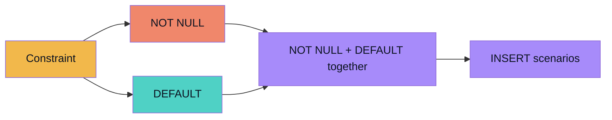
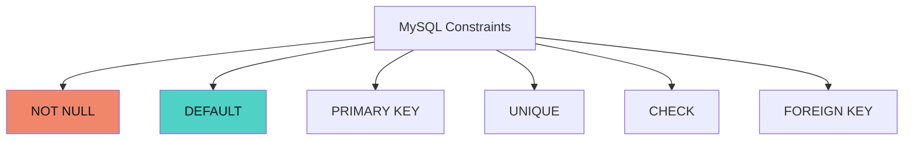
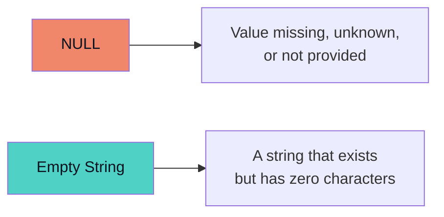
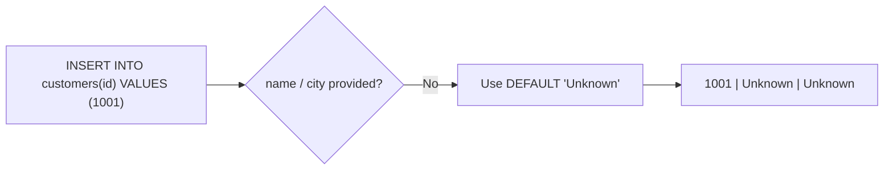
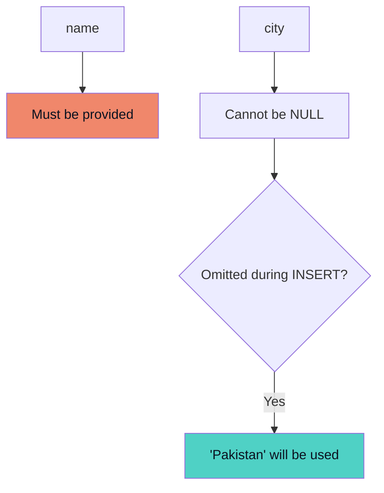
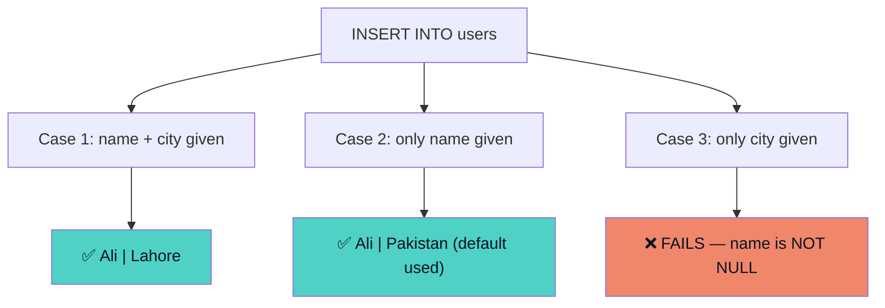
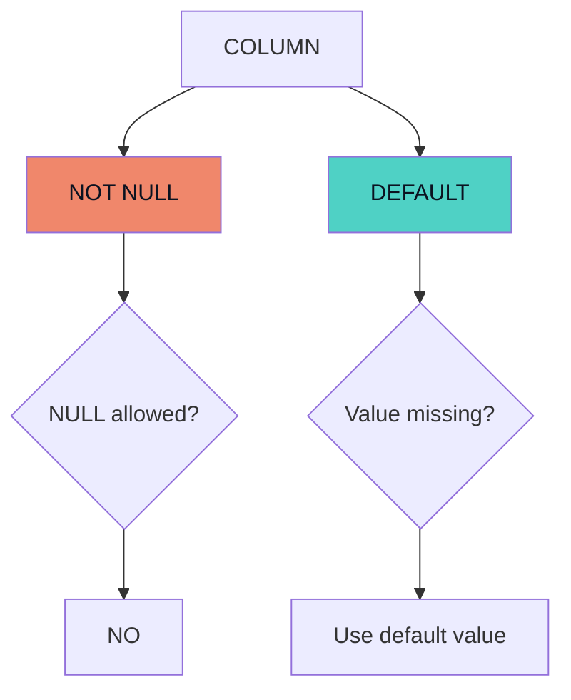
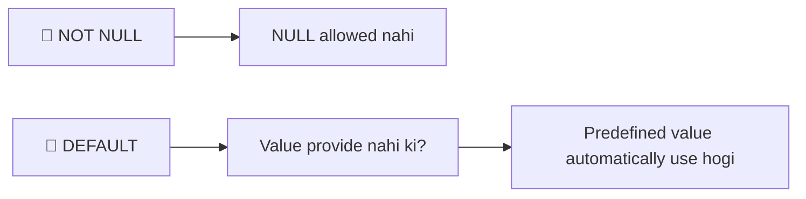

<div align="center">

# 🐬 MySQL Notes — NOT NULL & DEFAULT Constraints
### `Constraint` → `NOT NULL` → `DEFAULT` → `Together`

*Learning Path: Data Integrity → Required Fields → Automatic Values*


</div>

---

## 🗺️ Flow of This Topic



## 🧭 Quick Overview

| Concept | Main Purpose | Easy Question |
|---|---|---|
| 🚫 **NOT NULL** | Prevents a column from storing NULL | **Is this value required?** |
| 🎁 **DEFAULT** | Provides an automatic value | **What if no value is given?** |

---

## 1️⃣ What is a Constraint?

A **constraint** is a rule applied to a column to control what kind of data can be stored in it. Constraints help maintain **data integrity** and prevent invalid or unwanted data.



> 🎯 In this topic, we focus on **`NOT NULL`** and **`DEFAULT`**.

---

## 2️⃣ NOT NULL

`NOT NULL` is a constraint that ensures a column **cannot contain NULL values**.

> 🧠 **Simple Definition:** `NOT NULL` means a value is required for that column.

```sql
CREATE TABLE students (
    id INT NOT NULL,
    name VARCHAR(50) NOT NULL,
    city VARCHAR(100)
);
```

| Column | Required? |
|---|---|
| `id` | ✅ Required |
| `name` | ✅ Required |
| `city` | ⚪ Optional |

---

## 3️⃣ Why Use NOT NULL?

We use `NOT NULL` when a particular piece of information is important and should not be missing.

```sql
name VARCHAR(100) NOT NULL
```

A student's name should always be provided. Without `NOT NULL`, the column could silently contain `NULL`. With `NOT NULL`, MySQL **rejects** any insert that leaves it out.

---

## 4️⃣ NULL vs Empty String

These two things are **different**, and it's a very common confusion point.



```text
name = NULL   →  no value at all
name = ''     →  a value exists, it's just empty
```

---

## 5️⃣ Checking NULL Permission

```sql
DESC students;
```

```text
+-------+--------------+------+-----+
| Field | Type         | Null | Key |
+-------+--------------+------+-----+
| id    | int          | NO   |     |
| name  | varchar(50)  | NO   |     |
| city  | varchar(100) | YES  |     |
+-------+--------------+------+-----+
```

| `Null` value | Meaning |
|---|---|
| `NO` | NULL is **not** allowed → `NOT NULL` applied |
| `YES` | NULL is allowed |

---

## 6️⃣ DEFAULT

`DEFAULT` is a constraint that provides an **automatic value** when a value for that column is not provided during insertion.

> 🧠 **Simple Definition:** `DEFAULT` specifies the value MySQL should use when no value is provided for a column.

---

## 7️⃣ Example of DEFAULT

```sql
CREATE TABLE customers (
    id INT,
    name VARCHAR(50) DEFAULT 'Unknown',
    city VARCHAR(100) DEFAULT 'Unknown'
);

INSERT INTO customers(id)
VALUES (1001);
```



```text
+------+---------+---------+
| id   | name    | city    |
+------+---------+---------+
| 1001 | Unknown | Unknown |
+------+---------+---------+
```

---

## 8️⃣ Real-World Example

```sql
CREATE TABLE users (
    id INT,
    name VARCHAR(50) NOT NULL,
    city VARCHAR(100) DEFAULT 'Pakistan'
);

INSERT INTO users(id, name)
VALUES (1, 'Ali');
```

`city` was not provided, so `DEFAULT 'Pakistan'` kicks in:

```text
+----+------+----------+
| id | name | city     |
+----+------+----------+
| 1  | Ali  | Pakistan |
+----+------+----------+
```

---

## 9️⃣ NOT NULL and DEFAULT Together

```sql
CREATE TABLE customers (
    id INT,
    name VARCHAR(50) NOT NULL,
    city VARCHAR(100) NOT NULL DEFAULT 'Pakistan'
);
```



---

## 🔟 Important Difference

| | 🚫 NOT NULL | 🎁 DEFAULT |
|---|---|---|
| Controls | Whether `NULL` is allowed | Value inserted when column is omitted |
| Meaning | *"A NULL value is not allowed"* | *"If no city is provided, use `Pakistan`"* |

---

## 1️⃣1️⃣ NOT NULL vs DEFAULT — Comparison Table

| Feature | NOT NULL | DEFAULT |
|---|---|---|
| Purpose | Prevents NULL values | Provides automatic value |
| Makes value required? | ✅ Yes | ⚪ Not necessarily |
| Provides a value automatically? | ❌ No | ✅ Yes |
| Example | `name VARCHAR(50) NOT NULL` | `city VARCHAR(100) DEFAULT 'Pakistan'` |

---

## 1️⃣2️⃣ Important Scenario — 3 Cases

```sql
CREATE TABLE users (
    name VARCHAR(50) NOT NULL,
    city VARCHAR(100) DEFAULT 'Pakistan'
);
```



**Case 1 — Name and city provided**
```sql
INSERT INTO users(name, city) VALUES ('Ali', 'Lahore');
-- Result: Ali | Lahore
```

**Case 2 — City not provided**
```sql
INSERT INTO users(name) VALUES ('Ali');
-- Result: Ali | Pakistan  (default value used)
```

**Case 3 — Name not provided**
```sql
INSERT INTO users(city) VALUES ('Lahore');
-- ❌ Fails — name is NOT NULL and no name was given
```

> [!WARNING]
> Case 3 will always fail because `name` has no `DEFAULT` and is `NOT NULL` — MySQL has nothing to fall back on.

---

## 1️⃣3️⃣ Important Concept About DEFAULT

`DEFAULT` applies when the column value is **omitted from the INSERT statement**.

```sql
INSERT INTO users(name)
VALUES ('Ali');
```

If `city` has `DEFAULT 'Pakistan'`, MySQL automatically stores `Pakistan`.

---

## 1️⃣4️⃣ Practical Example

```sql
CREATE TABLE employees (
    id INT NOT NULL,
    name VARCHAR(100) NOT NULL,
    city VARCHAR(100) DEFAULT 'Pakistan'
);

INSERT INTO employees(id, name)
VALUES (101, 'Ahmed');

SELECT * FROM employees;
```

```text
+-----+--------+----------+
| id  | name   | city     |
+-----+--------+----------+
| 101 | Ahmed  | Pakistan |
+-----+--------+----------+
```

---

## 1️⃣5️⃣ Common Mistake

Don't confuse the two:

> **NOT NULL** → *"You cannot leave this value as NULL."*
> **DEFAULT** → *"If you don't provide a value, I'll use this predefined value."*

---

## 1️⃣6️⃣ Easy Mental Model



---

## 🎤 Interview Questions

<details>
<summary><b>Q1. What is NOT NULL?</b></summary>
<br><code>NOT NULL</code> is a constraint that prevents a column from storing NULL values.
</details>

<details>
<summary><b>Q2. Why do we use NOT NULL?</b></summary>
<br>We use <code>NOT NULL</code> to make important fields mandatory and maintain data integrity.
</details>

<details>
<summary><b>Q3. What is DEFAULT?</b></summary>
<br><code>DEFAULT</code> specifies an automatic value that MySQL uses when a column value is not provided during insertion.
</details>

<details>
<summary><b>Q4. Can NOT NULL and DEFAULT be used together?</b></summary>
<br>Yes.

```sql
city VARCHAR(100) NOT NULL DEFAULT 'Pakistan'
```
</details>

<details>
<summary><b>Q5. What is the difference between NOT NULL and DEFAULT?</b></summary>
<br><code>NOT NULL</code> prevents NULL values, while <code>DEFAULT</code> provides a predefined value when the column is omitted during insertion.
</details>

<details>
<summary><b>Q6. Does DEFAULT make a column NOT NULL?</b></summary>
<br>No. <code>DEFAULT</code> and <code>NOT NULL</code> have different purposes. A default value does not by itself mean that NULL is prohibited.
</details>

---

## 🧠 Quick Revision



```sql
CREATE TABLE customers (
    id INT NOT NULL,
    name VARCHAR(50) NOT NULL,
    city VARCHAR(100) DEFAULT 'Pakistan'
);
```

<div align="center">

> **NOT NULL controls whether NULL is allowed, while DEFAULT controls what value is automatically used when a column is omitted during INSERT.**

</div>

---

<details>
<summary>📁 Suggested GitHub File Structure (click to expand)</summary>

```text
mysql/
│
├── 01_mysql_basics.md
├── 02_database_and_tables.md
├── 03_primary_key_auto_increment_alias.md
├── 04_where_update_delete_string_functions.md
└── 05_not_null_default_constraints.md
```

</details>

<div align="center">

**Keep practicing. Understand what each constraint is protecting — not just how to spell it. 🐬🔥**

</div>
