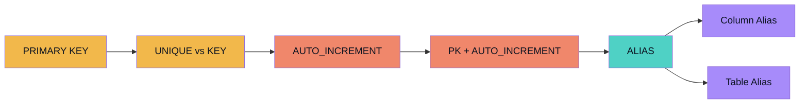
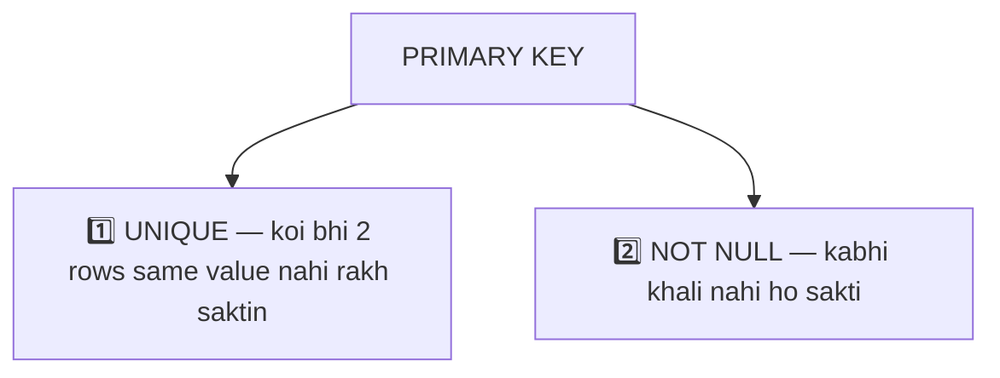
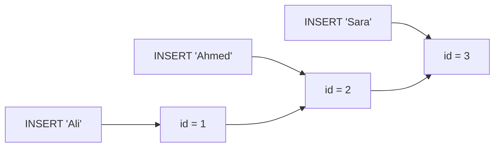
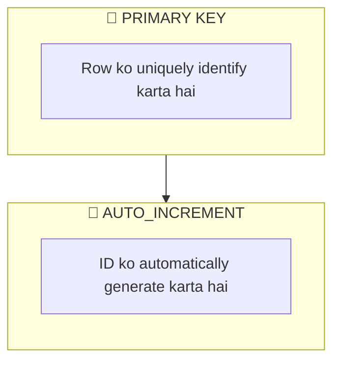
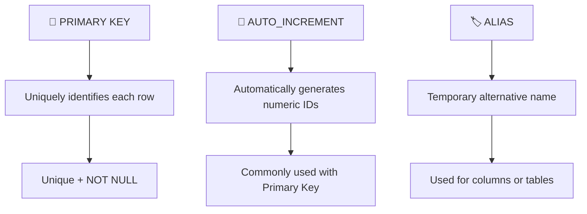

<div align="center">

# 🐬 MySQL Notes — Primary Key, AUTO_INCREMENT & Alias
### `PRIMARY KEY` → `AUTO_INCREMENT` → `ALIAS`

*Learning Path: Constraints → Identity → Automatic IDs → Readable Queries*


</div>

---

## 🗺️ Is Notes Ka Flow



## 🧭 Quick Overview

| Concept | Main Purpose | Easy Question |
|---|---|---|
| 🔑 **PRIMARY KEY** | Uniquely identifies each row | **Which row is this?** |
| 🔢 **AUTO_INCREMENT** | Automatically generates numeric IDs | **What ID should the new row get?** |
| 🏷️ **ALIAS** | Gives a temporary name to a column/table | **How should I display/reference this?** |

---

## 🔑 1. PRIMARY KEY

Ek **Primary Key** ek constraint hai jo table ki **har row/record ko uniquely identify** karti hai.

> 🧠 **Simple Definition:** A Primary Key uniquely identifies each row in a table.

```text
id    name      city
1001  Alex      Lahore
1002  Ahmed     Karachi
1003  John      Islamabad
```

Yahan `id` Primary Key ban sakta hai — har value ek specific row identify karti hai.

### ⭐ Properties of a Primary Key



**Unique:**
```text
1001 → Alex
1001 → Ahmed   ❌  Duplicate values allowed nahi hain
```

**NOT NULL:**
```text
id
----
1001
1002
NULL   ❌  Har row ko valid identifier chahiye
```

### 🛠️ Creating a Primary Key

```sql
CREATE TABLE customers (
    id INT PRIMARY KEY,
    name VARCHAR(50),
    city VARCHAR(100)
);
```

Yahan `id → PRIMARY KEY`, isliye ye hamesha `UNIQUE + NOT NULL` hoga.

---

## 🔒 PRIMARY KEY vs UNIQUE

Dono uniqueness enforce karte hain, lekin **purpose alag hai**.

| | 🔑 PRIMARY KEY | 🔒 UNIQUE |
|---|---|---|
| Kaam | Row ko uniquely identify karta hai | Column mein duplicate values rokta hai |
| NULL allow? | ❌ Nahi | ✅ Ho sakta hai |
| Per table | Sirf 1 | Multiple ho sakte hain |

```sql
CREATE TABLE users (
    id INT PRIMARY KEY,
    email VARCHAR(100) UNIQUE,
    name VARCHAR(100)
);
```

> 🧠 **Memory Trick:**
> **PRIMARY KEY → "Which row is this?"**
> **UNIQUE → "Is this value already used?"**

---

## 🔢 2. AUTO_INCREMENT

`AUTO_INCREMENT` MySQL ko batata hai ke **naya row insert hote hi agla numeric value automatically generate karo**.

> 🧠 **Simple Definition:** AUTO_INCREMENT automatically generates sequential numeric values for a column when new records are inserted.

### 😓 Without AUTO_INCREMENT

```sql
CREATE TABLE customers (
    id INT PRIMARY KEY,
    name VARCHAR(50)
);

INSERT INTO customers(id, name) VALUES (1, 'Ali');
INSERT INTO customers(id, name) VALUES (2, 'Ahmed');
```

`id` humein manually dena padta hai.

### 🚀 With AUTO_INCREMENT

```sql
CREATE TABLE customers (
    id INT PRIMARY KEY AUTO_INCREMENT,
    name VARCHAR(50)
);

INSERT INTO customers(name) VALUES ('Ali');
```

MySQL khud generate karta hai:



> 🧠 **Trick:** `AUTO_INCREMENT` → *"Agla number khud de do."*

---

## 🤝 PRIMARY KEY + AUTO_INCREMENT

In dono ke **alag alag jobs** hain.



### Common Pattern

```sql
CREATE TABLE users (
    id INT PRIMARY KEY AUTO_INCREMENT,
    name VARCHAR(100) NOT NULL,
    email VARCHAR(255) UNIQUE
);
```

> 🔑 **PRIMARY KEY:** "Ye is user ki unique identity hai."
> 🔢 **AUTO_INCREMENT:** "Main wo identity number generate kar dunga."

---

## 🏷️ 3. ALIAS

Ek **Alias** column ya table ko **query ke andar temporary alternative naam** deta hai.

> 🧠 **Simple Definition:** An alias is a temporary alternative name given to a column or table in a SQL query.

### 🏷️ Column Alias

```sql
SELECT name AS 'Customer Name'
FROM customers;
```

```text
Customer Name
-------------
Ali
Ahmed
John
```

> [!IMPORTANT]
> Database mein column ab bhi `name` hi kehlata hai. **Alias permanently rename nahi karta** — sirf query result mein naya naam dikhata hai.


### ✂️ `AS` Keyword

```sql
SELECT name AS customer_name
FROM customers;
```

MySQL mein ye bhi chal jata hai (lekin `AS` zyada readable hai):

```sql
SELECT name customer_name
FROM customers;
```

### 🏷️ Table Alias

```sql
SELECT c.name
FROM customers AS c;
```

`customers → c`, isliye `customers.name` ki jagah sirf `c.name` likh sakte hain. Table aliases **multiple tables aur JOINs** ke sath bohot useful hote hain.

---

## 🧩 Complete Example

```sql
CREATE TABLE users (
    id INT PRIMARY KEY AUTO_INCREMENT,
    name VARCHAR(100) NOT NULL,
    email VARCHAR(255) UNIQUE
);

INSERT INTO users(name, email) VALUES ('Ali', 'ali@gmail.com');
INSERT INTO users(name, email) VALUES ('Ahmed', 'ahmed@gmail.com');
```

MySQL automatically generates:

```text
id    name    email
1     Ali     ali@gmail.com
2     Ahmed   ahmed@gmail.com
```

Ab alias use karte hain:

```sql
SELECT name AS 'Customer Name', email AS 'Email Address'
FROM users;
```

```text
Customer Name    Email Address
--------------   ----------------
Ali              ali@gmail.com
Ahmed            ahmed@gmail.com
```

Lekin actual database columns ab bhi `name` aur `email` hi hain.

---

## 🧠 PRIMARY KEY vs AUTO_INCREMENT vs ALIAS

| Concept | Kya karta hai? | Stored data change karta hai? |
|---|---|---|
| 🔑 PRIMARY KEY | Row ko uniquely identify karta hai | Nahi |
| 🔢 AUTO_INCREMENT | Numeric IDs automatically generate karta hai | ID value generate karta hai |
| 🏷️ ALIAS | Temporary query naam deta hai | Nahi |

---

## 🎯 Real-World Mental Model

```text
Student ID    Name        Email
     1        Ali         ali@gmail.com
     2        Ahmed       ahmed@gmail.com
     3        Sara        sara@gmail.com
```

- 🔑 **PRIMARY KEY:** Student ID har student ko uniquely identify karta hai.
- 🔢 **AUTO_INCREMENT:** MySQL khud deta hai `1 → 2 → 3 → 4 → ...`
- 🏷️ **ALIAS:** `Name` ki jagah `Student Name` dikha sakte hain, bina actual column change kiye.

---

## 🎤 Interview Questions

<details>
<summary><b>Q1. What is a Primary Key?</b></summary>
<br>A Primary Key is a constraint that uniquely identifies each row in a table.
</details>

<details>
<summary><b>Q2. Can a Primary Key contain duplicate values?</b></summary>
<br>No. Primary Key values must be unique.
</details>

<details>
<summary><b>Q3. Can a Primary Key contain NULL?</b></summary>
<br>No. A Primary Key cannot contain NULL values.
</details>

<details>
<summary><b>Q4. What is AUTO_INCREMENT?</b></summary>
<br>AUTO_INCREMENT automatically generates sequential numeric values for a column when new rows are inserted.
</details>

<details>
<summary><b>Q5. Why is AUTO_INCREMENT commonly used with a Primary Key?</b></summary>
<br>A Primary Key needs unique values, and AUTO_INCREMENT can automatically generate new numeric IDs for each record.
</details>

<details>
<summary><b>Q6. Does AUTO_INCREMENT itself make a column a Primary Key?</b></summary>
<br>No. They are different concepts. PRIMARY KEY defines the unique identifier, while AUTO_INCREMENT generates numeric values automatically.
</details>

<details>
<summary><b>Q7. What is an Alias?</b></summary>
<br>An alias is a temporary alternative name given to a column or table in a SQL query.
</details>

<details>
<summary><b>Q8. Does an alias permanently rename a column?</b></summary>
<br>No. An alias only affects that particular query's result or references.
</details>

<details>
<summary><b>Q9. What is the difference between PRIMARY KEY and UNIQUE?</b></summary>
<br>PRIMARY KEY is used to uniquely identify each row, while UNIQUE is used to prevent duplicate values.
</details>

---

## ⚡ Quick Revision



> 🧠 **One-Line Memory Trick:**
> **PRIMARY KEY identifies → AUTO_INCREMENT generates → ALIAS renames temporarily.**

---

## 📝 Practice Checklist

- [ ] What is a Primary Key?
- [ ] Why must a Primary Key be unique?
- [ ] Can a Primary Key be NULL?
- [ ] Difference between PRIMARY KEY and UNIQUE
- [ ] What does AUTO_INCREMENT do?
- [ ] Why is AUTO_INCREMENT commonly used with IDs?
- [ ] What is a column alias?
- [ ] What is a table alias?
- [ ] Does an alias permanently rename a column?
- [ ] Difference between PRIMARY KEY, AUTO_INCREMENT and ALIAS

---

### 🚀 Learning Flow


<div align="center">

**Keep practicing. Goal ye nahi ke SQL ratta lagao — samjho ke har part kya kar raha hai. 🐬🔥**

</div>
