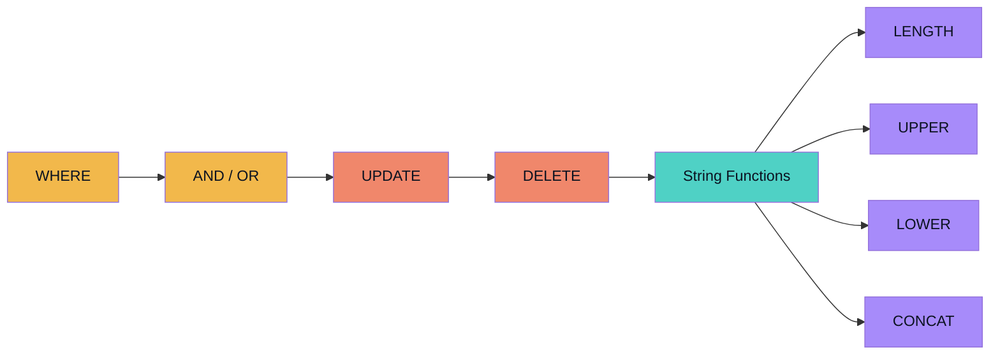
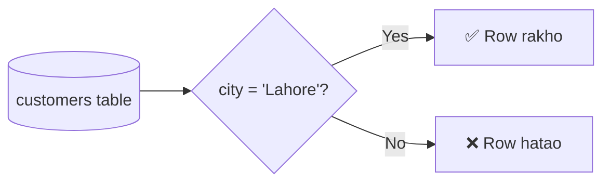
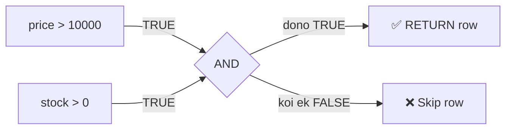
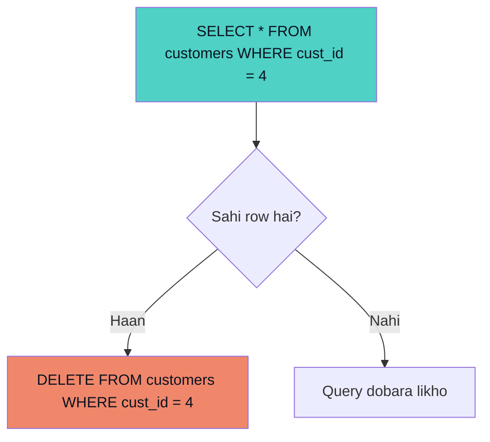
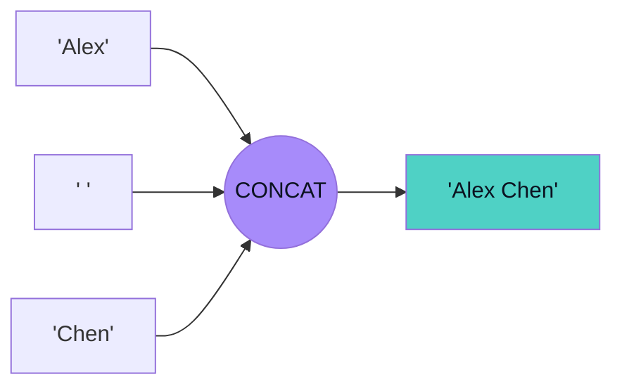
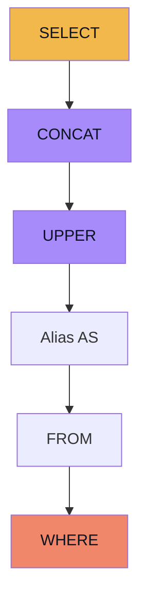
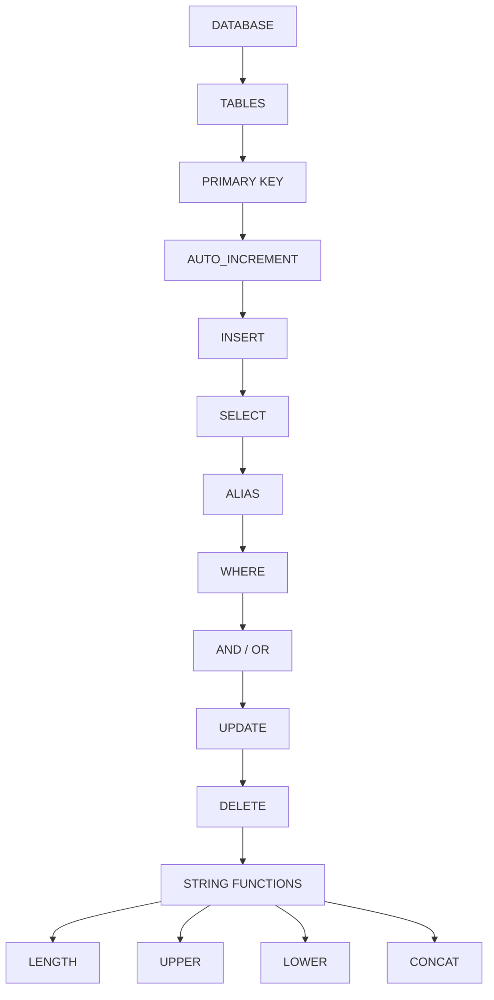

<div align="center">

# 📘 MySQL Notes — Part 2
### `WHERE` → `UPDATE` → `DELETE` → `String Functions`

*Prerequisite: Database, Tables, Primary Key, AUTO_INCREMENT, INSERT, SELECT, Alias*


</div>

---

## 🗺️ Is Notes Ka Flow



---

## 🔎 1. WHERE Clause

`WHERE` clause ka use **specific rows ko condition ke basis par filter** karne ke liye hota hai.

> 🧠 **Easy Trick:** `WHERE` = **WHICH ROW?** — Jab bhi WHERE dekho, poochho: *"Mujhe kaunsi row chahiye?"*

```sql
SELECT *
FROM customers
WHERE city = 'Lahore';
```

> Customers table mein se sirf woh rows lao jahan city Lahore hai.

**Important concept:**

```text
SELECT → Kaun se columns chahiye?
WHERE  → Kaun si rows chahiye?
```



---

## 🔗 2. AND Operator

Multiple conditions lagane ke liye `AND` use hota hai.

> 🧠 **Rule:** `AND` ke saath **dono conditions TRUE** honi chahiye.

```sql
SELECT *
FROM products
WHERE price > 10000
AND stock > 0;
```



---

## 🔀 3. OR Operator

`OR` tab use hota hai jab **conditions mein se koi ek TRUE** ho.

```sql
SELECT *
FROM customers
WHERE city = 'Lahore'
OR city = 'Karachi';
```

| Operator | Matlab |
|---|---|
| `AND` | dono chahiye |
| `OR` | koi ek chalega |

---

## ✏️ 4. UPDATE

`UPDATE` ka use database mein **existing data change/modify** karne ke liye hota hai.

```sql
UPDATE customers
SET city = 'Islamabad'
WHERE cust_id = 3;
```

> Customer ID 3 ki city Islamabad kar do.

> [!WARNING]
> **WHERE ke baghair UPDATE dangerous hai:**
> ```sql
> UPDATE customers
> SET city = 'Islamabad';
> ```
> Is case mein **table ki saari rows update ho sakti hain.**

> 🧠 **Golden Rule:** UPDATE karne se pehle WHERE condition check karo.

**Multiple columns update:**

```sql
UPDATE products
SET price = 2000,
    stock = 20
WHERE prod_id = 4;
```

```text
SET   → multiple values ko comma (,) se separate karo
WHERE → conditions ko AND / OR se combine karo
```

---

## 🗑️ 5. DELETE

`DELETE` ka use table se **existing rows remove** karne ke liye hota hai.

```sql
DELETE FROM customers
WHERE cust_id = 4;
```

> [!DANGER]
> **DELETE without WHERE** — poori table ki rows delete ho sakti hain:
> ```sql
> DELETE FROM customers;
> ```

**Safe habit — verify before delete:**



---

## 🧵 6. String Functions

MySQL ke built-in functions jo **text/string data manipulate ya analyze** karte hain:

| Function | Kaam |
|---|---|
| `LENGTH()` | string ki length batata hai |
| `UPPER()` | UPPERCASE mein convert karta hai |
| `LOWER()` | lowercase mein convert karta hai |
| `CONCAT()` | strings ko join karta hai |

---

### 📏 LENGTH()

```sql
SELECT LENGTH('Hello');
-- Result: 5

SELECT LENGTH(first_name) AS name_length
FROM customers;
```

> 🧠 **Trick:** `LENGTH()` → *"Kitna long?"*

---

### 🔠 UPPER()

```sql
SELECT UPPER(first_name) AS uppercase_name
FROM customers;
```

`Anees` → `ANEES`

> 🧠 **Trick:** `UPPER()` → text ko **UPPER** karo.

---

### 🔡 LOWER()

```sql
SELECT LOWER(first_name) AS lowercase_name
FROM customers;
```

`ANEES` → `anees`

> 🧠 **Trick:** `LOWER()` → text ko **lower** karo.

---

### 🔗 CONCAT()

```sql
SELECT CONCAT('Hello', ' ', 'World');
-- Result: Hello World
```

**Table ke saath:**

```sql
SELECT CONCAT(first_name, ' ', last_name) AS customer_name
FROM customers;
-- Result: Alex Chen
```



> [!IMPORTANT]
> `''` (empty string) → **no space** → `AneesAli`
> `' '` (one space) → **space milta hai** → `Anees Ali`
> 🔥 Isko yaad rakhna — yehi sabse common mistake hai.

---

## 🧩 7. Functions Ko Combine Karna

```sql
SELECT CONCAT(
    UPPER(first_name),
    ' ',
    UPPER(last_name)
) AS customer_name
FROM customers
WHERE city = 'Lahore';
```



---

## 🧠 Master Revision



### 🔥 Super Short Memory Sheet

| Keyword | Yaad Rakho |
|---|---|
| `SELECT` | Data nikalo |
| `WHERE` | Kaunsi rows? |
| `AND` | Dono conditions |
| `OR` | Koi ek condition |
| `UPDATE` | Existing data change |
| `DELETE` | Existing row remove |
| `LENGTH()` | Length batao |
| `UPPER()` | Uppercase |
| `LOWER()` | Lowercase |
| `CONCAT()` | Strings join |
| `AS` | Alias / temporary result name |

---

<details>
<summary>📁 Suggested GitHub File Structure (click to expand)</summary>

```text
mysql/
│
├── 01_mysql_basics.md
├── 02_database_and_tables.md
├── 03_primary_key_auto_increment_alias.md
└── 04_where_update_delete_string_functions.md
```

</details>

---

<div align="center">

**Abhi tak ke concepts ke liye ye perfect stopping point hai.** ✅
Ab String Functions mein next function se continue karna hai — har naya concept aayega toh isi file ko update karte jayenge. 🔥

</div>